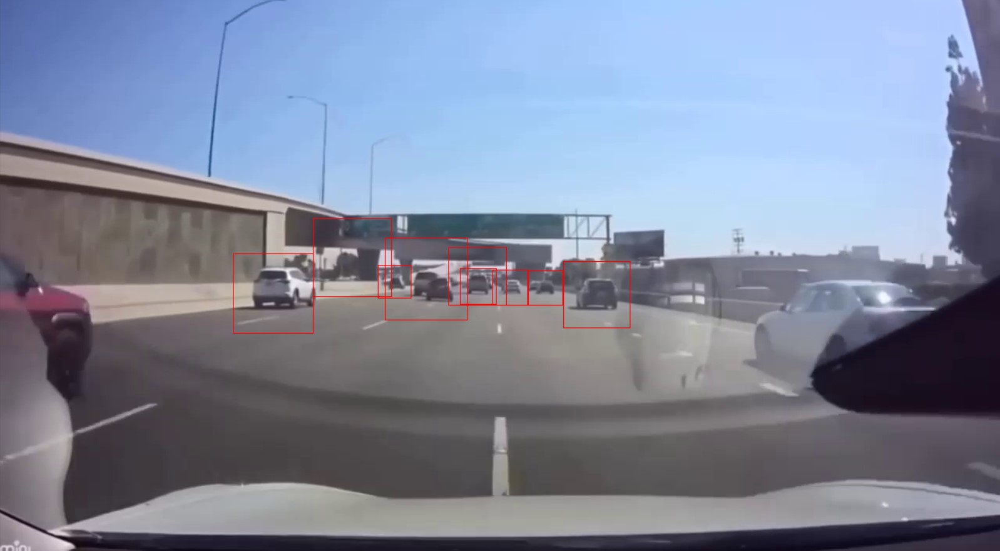
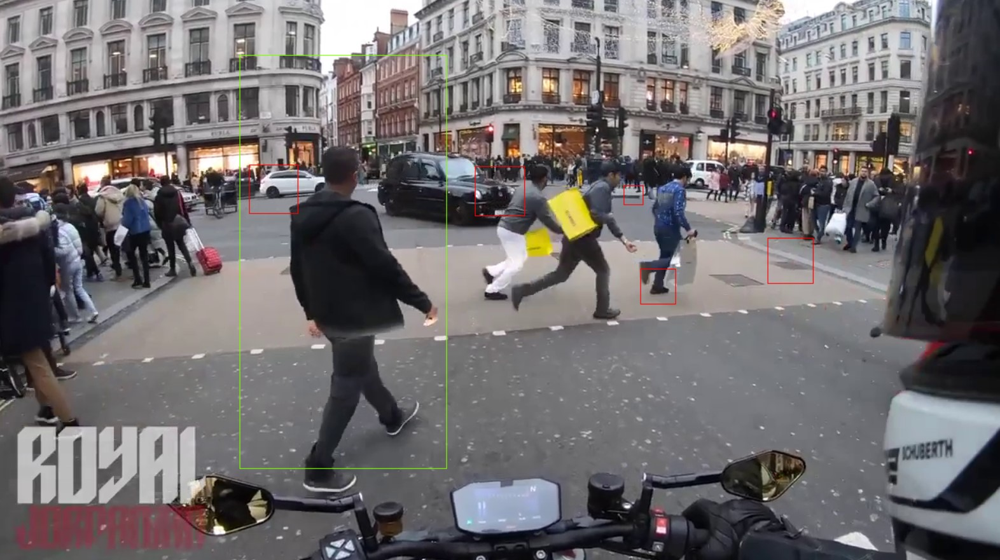

# Self-Driving Car Object Detection

This project focuses on the implementation of object detection for autonomous vehicles using computer vision techniques. By simulating human vision, the system detects various objects on the road such as cars, pedestrians, and road signs to enable safe navigation.

### Key Features:
- **Object Detection**: Utilizes Haar classifiers and OpenCV for detecting objects like cars and pedestrians.
- **Image Processing**: Converts images to black and white for faster recognition.
- **Real-time Detection**: Processes video frames for live object detection, making it suitable for autonomous vehicles.

### Technologies:
- Python
- OpenCV
- Haar Cascade Classifier

### Conclusion:
The project demonstrates the importance of object detection in autonomous vehicles, helping improve road safety and paving the way for fully self-driving cars in the future.
